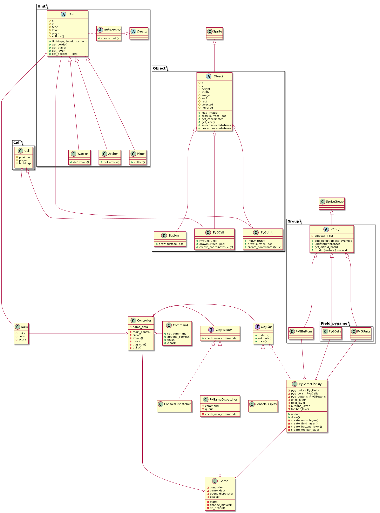

# Реализация (Технологии программирования)
Создание (для 1 чекпоинта)
--------------------
Создание юнитов. Реализован паттерн фабрика для юнитов. Конструктор каждого поля - его создание от каких-то параметров(рельефа, который на нем находиться.
На данный момент хранение игрвой информации в map'ах в классе Data. 
Аналогичный паттерн для создания cell'ов (шахты и казармы).

Структурные паттерны (для 2 чекпоинта)
--------------------
Для отображения игры используется библиотека pygame, использован **паттерн _декоратор_**(такая полезная обертка) для использования и расширения базовых классов Unit и Cell - PugUnit и PygCell. 
Оба имеют одинаковый функционал и наравне с кнопками Button наследуются от класса Object(наследующегося от sprite.Sprite). 

Так же был добавлен класс Group(наследующийся от sprite.Group) для, например, отрисовки всех PygUnit и PygCell разом. Все это отображено на новой подробной UML-диаграмме.

Также был создан класс Display(абстрация, вместо которой можно подставлять либо PyGameDisplay, либо ConsoleDisplay) и Dispatcher(соответственно PyGameDisplay и ConsoleDisplay) для успешного взаимодействия с классом Controller. 

С такой структурой легко добавить новый способ отрисовки, например, в браузере, не изменяя внутренний механизм работы. Таким образом был реализован **паттерн _мост_**.

Взаимодействие (то, что должно быть сделано до 3 дедлайна)
--------------------
Игрок взаимодействует с полем(играет).
Игрок может строить города на своей территории(build) или создавать новые отряды(create), перемещать войска(move), нападать на соперника(attack), улучшать своих юнитов(upgrade).

UML diagram:
=============================

